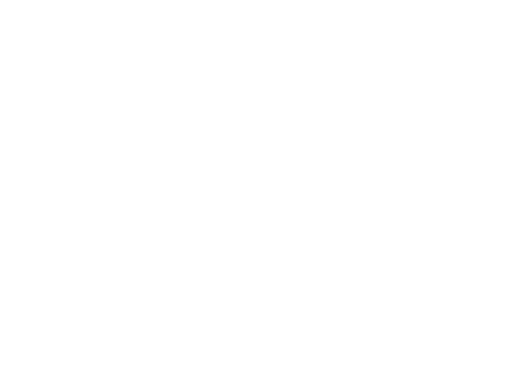

&nbsp;&nbsp;&nbsp;&nbsp;&nbsp;&nbsp;&nbsp;&nbsp;&nbsp;&nbsp;&nbsp;&nbsp;&nbsp;  

# LEGENDS OF ASGARD
#### Welcome to the readme file for the Legends of Asgard website!

## PLANNING & DESIGN

   Legends of Asgard is an informational website centred around the Old Norse Gods/Goddesses, the Aesir and Vanir.
   This site has been created for a project while undertaking the Code Institute Level 5 Diploma - Web Application Development. 
   I have a real passion for Norse Mythology and enjoy talking about it. I figured there would be others like me
   who like to learn and chat about this topic, and so the purpose of this site is to provide eye-catching and informative content about a subject 
   that intrigues so many people, with the objective of strengthening the community and providing a platform for said community to flourish.
   
   ### User Stories & Target Audience
   The user stories can be found within the tasks [HERE](https://github.com/users/Dave-MK/projects/3)
   - Aimed at people of all ages and backgrounds, this site is created with entertainment as this is centered around Norse Mythology, so nothing is stated as factual.
   - The site is perfect for anyone interested in the Norse culture, whether knowledgeable already or none prior.

   #### The site will contain:
   - A one page structure with mobile first design
   - 10 sections in total:
       - A hero containing CTAs with a mobile first approach, with sticky side menu
       - 7 sections each for the Sagas of the Norse Gods
       - A section containing information about the 9 realms/worlds of Norse mythology
       - A contact section in the footer

#### The general direction and structure can be seen here in the [WIREFRAMES](https://github.com/Dave-MK/mp1-legends-of-asgard/blob/main/assets/images/Legends_of_Asgard_WF.png)

   ### Directional reasoning
   - Some original decisions made in the planning phase were reviewed during development:
       - Originally it was planned to utilise Bootstrap for the layout and style support, but it became apparent that using Bootstrap would complicate and potentially cause issues when creating some of the custom CSS rules
       - The menu and sections were originally planned to be a carousel, but opted for a linear flow during development as to prevent confusion and ensure a simple flow of content and readability
       - Originally the animated menu on larger screens was to be laid out along the bottom of the page, but I decided that in-line with the above change, the menu would flow better fixed to the right side of the page
       - Each section was to have a header with an image of the god and the name, but due to the image size and portability, I decided to make each section fill the viewport with a full background image, this ensures that when moving from device to device users will have the same experience
       - A share icon was originally planned, but this was forsaken during development as browsers provide this functionality and I saw this as an extra icon/distraction away from the content
       - The plan was to have a tree of gods and how each relates to one another, but during development this was proven to be more work than originally perceived and so altered this to be a list of the nine realms with tooltip info

- Structure
    - Being an informational site, I wanted users to have an experience similar to reading a kindle book and so went for a one page structure separated into sections thats utilise scroll snapping, allowing users the options of easier scrolling or use of the menu
    - A linear, one page approach I feel was justified when designing with a mobile first approach, but using media queries easily ensuring content is responsive and suitable for larger devices
    - A mobile menu is availble for small devices, but is transformed into an animated carousel menu for larger devices or smaller devices that are landscape orientation
    - I have depicted my thoughts in my wireframes, though some changes came later

- Imagery
    - This was a painstaking process, as I wanted something that makes the content seem new or refreshing
    - Rather than use stock images, that appeared bland and lacked imagination, my images and realm icons were generated using adobe firefly text to image prompts, but proved fruitful once I had the overall theme and idea in mind
    - Creating the images helped finalise the colour design choices for the overall site

- Colour
    - As mentioned above I had an idea of a general colour design, which I tested various times during the gathering of the images
    - Once I had settled on the theme of the images, I then colour picked based on the overall shadows, midtones and highlights of the images
    - There was some small alterations once in development to ensure text properly contrasted from the background 

### Features

- Glassmorphism
    - The colours chosen for the site meant the text on smaller screens was a bit less visible. After some research and trial and error I found a solution in having a glassmorphic background for each of the Saga divs. You can read more about this HERE and see a tutorial I utilised HERE.

- Mobile Menu / Animated Carousel side menu
    - Probably the most prominent features of the site on smaller devices you will use the hamburger menu, which has a small animation when opened and closed. The mobile menu changes when traversing onto medium and large devices, a vertical menu fixed to the right side of the screen, when static appears greyscale and plain, but when hovered
    over gives life to the menu and creates an oscelating style animation between each of the elements in the menu. The best part about this menu is the fact thats it is CSS only and no JS is needed, allowing me to add in some functionality and animation without the need for JS.

## IMPLEMENTATION & TESTING

- The live working site can be viewed [HERE](https://dave-mk.github.io/mp1-legends-of-asgard)

- The original manual test script can be viewed [HERE](https://dave-mk.github.io/mp1-legends-of-asgard)

- All project tasks along with issues logged can be viewed [HERE](https://github.com/users/Dave-MK/projects/3)

## ACKNOWLEDGEMENTS

- All photographic/artistic imagery used on this project has been generated by David Kilgallon using Adobe Firefly Text to Image AI - click here to learn more
- The logo, which is also displayed atop this file is the Old Norse symbol representing Asgard and was downloaded from freepik.com
- The animated CSS only side menu as seen on some tablet, laptop and desktop resolutions was created with the help of a youtube tutorial by LunDev, which can be viewed HERE

