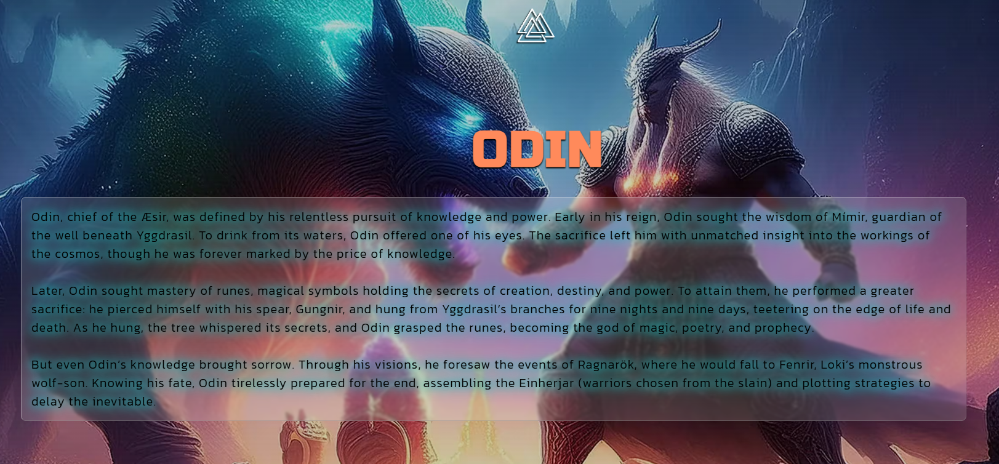
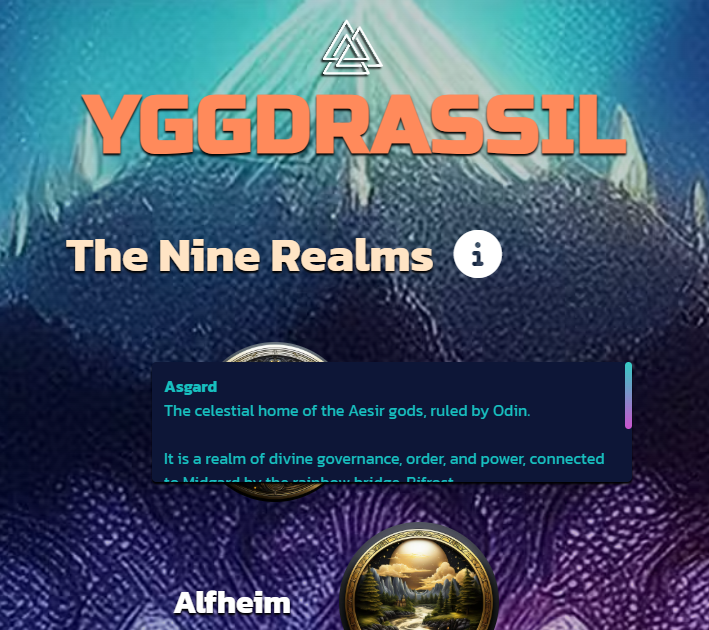

# Legends of Asgard
---

Legends of Asgard is a site for visitors to get their fix of Norse Mythology, whether they are a newcomer, an enthusiast or just a returning visitor they can learn about
the many Gods and the Realms in which they dwelled. There is a contact form available and social links where visitors can follow the sites social accounts.

The site can be accessed by this [link](https://dave-mk.github.io/mp1-legends-of-asgard)

---
## User Stories

### First Time Visitor Goals:

* As an event planner, I would like to contact the site owner, to discuss working together on a Norse themed event I am planning

### Returning Visitor Goals:

* As a lover of Old Norse culture I want to see more information about the nine realms together with the ability to see the information about them, so that I better understand the Old Norse beliefs
* As a Norse Mythology teacher, I would like the ability to share information about the Viking gods and Sagas, so that I can easily share them with my students in an interesting format
* As a returning visitor of the site, I would like to sign up for updates, so that I can find out when new gods and sagas are added

### Frequent Visitor Goals:
* As a Mythology/Folklore enthusiast, I would like an area showing all the gods with links to their short blurbs and saga info displayed in eye catching card format, so that I may quickly find the sagas and all the information I need
* As a Norse Mythology student, I would like to click a link that goes to external knowledge articles with more in depth information, so that I can build on my knowledge and ensure my work is cited from a reputable source

## Features

+ ### Navbar

+ ##### Navigation
    - Taking a Mobile first approach:
        * On mobile and tablet Devices  
        
        - When the hamburger menu is clicked, there is dropdown menu with the links in the same order. Essentially this is a mobile version of the
        Desktop side menu specified below. 
        
        

        * On Desktop devices: 
        - The navigation bar has the logo in the center and the hamburger menu disappears and is replaced with a fixed graphical side menu positioned a bit further down the viewport on the right hand side. With a nice CSS hover effect.     
        &nbsp;&nbsp;&nbsp;&nbsp;&nbsp;&nbsp;
        
    

---

+ #### Hero Section

    - Hero section has a fixed background image.

    - Hero section has a header text that consist:

        * The name of the site.
        * Short blurb building anticipation for the content that follows.
    
    

--- 

+ #### God Section(s)

    - Each section contains a static background image of the relevant God, with the Gods name at the top.

    - A lengthy blurb with a Glassmorphic background contains details relating to the God for its relevant section.

    - The blurb (sagas) tell stories urging the user to continue reading.

    
    
    
    
    
    
    
      

    ---
+ #### YGGDRASSIL

    - Originally planned to be a tree of the gods showing links and relationships, but realised
    during development that this would be more time consuming than originally planned. 
    

    - Each realm is hoverable and when hovered displays a tooltip with a description. 
    

---
+ #### The Althing

    - The Althing section has a contact form:

        - All text input fields are customized.
        - Labels are animated when the input field is in focus and are not empty.
        - All inputs are set to be required to fill out.

        - The submit button is animated on hover.

    - The 'Gods Hear Me' button leads to the response page. 
​
      

---

+ #### Footer

    - Footer contains social media links that open in a new tab.

    - This is a fixed footer.

    - Links highlight on hover.

      

---

+ ### Thank you response page

    - Response page appears after submitting the contact form.
    - It contains the thank you message and a button to return to the homepage.

      

---
## Technologies Used

- [HTML](https://developer.mozilla.org/en-US/docs/Web/HTML) was used as the foundation of the site.
- [CSS](https://developer.mozilla.org/en-US/docs/Web/css) - was used to add the styles and layout of the site.
- [CSS Flexbox](https://developer.mozilla.org/en-US/docs/Learn/CSS/CSS_layout/Flexbox) - was used to arrange items simmetrically on the pages.
- [CSS roots](https://developer.mozilla.org/en-US/docs/Web/CSS/:root) was used to declaring global CSS variables and apply them throughout the project. 
- [Figma](https://figma.com/) was used to make wireframes for the website.
- [VSCode](https://code.visualstudio.com/) was used as the main tool to write and edit code.
- [Git](https://git-scm.com/) was used for the version control of the website.
- [GitHub](https://github.com/) was used to host the code of the website.
- [Adobe Firefly](https://www.adobe.com/uk/products/firefly.html) was used to create images and icons for the site using AI text to image technology.

---
## Design

### Color Scheme

  

- I spent time creating the images for the site with my desired colours, once I had these I then extracted certain colours to use for font and other imagery.

- Oxford Blue was used as the main background colour of the website as a fall back for if the images dont render.

- Robin Egg Blue was used as the primary colour with Coral as the secondary colour, as I found these to bring out the transcendance and magic of the Norse myth.
Creating a softer image of something that once ruled the minds and belief systems of so many people hundreds of years ago.

- Delft Blue and Berkley Blue were used as the main button and CTA primary colour and highlight colour as a contrast away from the 
primary colours of the site and be more noticeable for the user scrolling.

### Typography

- Russo One Google Font was used as the main font of the website in order to increase readability, but to also portray the structure like feel that the belief in Asgard brought to the Vikings.

- Kanit Google Font was used to be easy to read in large paragraphs, but be somewhat different from the primary font.

### Wireframes

#### All screen sizes

- [All wireframes](documentation/latest_wireframe.png)

---

## Testing

Please refer to the [TESTING.md](TESTING.md) file for all test-related documentation.

### Accessibility & Performance

 

 

---

## Deployment

### Deployment to GitHub Pages

- The site was deployed to GitHub pages. The steps to deploy are as follows: 
  - In the [GitHub repository](https://github.com/Dave-MK/mp1-legends-of-asgard), navigate to the Settings tab 
  - From the source section drop-down menu, select the **Main** Branch, then click "Save".
  - The page will be automatically refreshed with a detailed ribbon display to indicate the successful deployment.

The live link can be found [here](https://dave-mk.github.io/mp1-legends-of-asgard)

### Local Deployment

In order to make a local copy of this project, you can clone it.
In your IDE Terminal, type the following command to clone my repository:

- `git clone https://github.com/Dave-MK/mp1-legends-of-asgard.git`

---

## Future improvements
- Add custom 404 page.
- Improve the quality of the commit messages (I am aware that some of them may not meet the standards and will improve these in the future)
- Add fully functional contact form.
- Add opt-in form for email addresses or incorporate this into the contact form via a opt-in checkbox.
- Add the external links to God wikis for more reputable source referencing.

---
## Credits

+ #### Content

    - The God Menu hover effect was inspired by and created using a CSS Youtube tutorial by Lun Dev. 
    This allowed me to create something that normally would require Javascript. The tutorial can be viewed [here](https://www.youtube.com/watch?v=P80sM7ausCA).
    - The Glassmorphic backgrounds on the blurbs of the site, were created using another Lun Dev tutorial as see [here](https://www.youtube.com/watch?v=bnC-kuL_CYw).

+ #### Media

    - All the images for the website were created using text to image AI in [Adobe Firefly](https://www.adobe.com/uk/products/firefly.html).

+ #### Tools

    - [Compress PNG](https://compresspng.com/) was used to compress PNG images.
    - [Convert PNG to WEBP](https://convertio.co/png-webp/) was used to convert PNG images to WEBP.
    - [Convert WEBP to AVIF](https://convertio.co/webp-avif/) was used to convert WEBP images to AVIF.
    - [Coolers](https://coolors.co/) was used to create the color palette.

---

## Acknowledgments

- [Miguel Ortiz](https://www.cityofbristol.ac.uk/), my college tutor has been majorly supportive, allowing me an extension when issues at home conflicted with my project. 
- [Iuliia Konovalova](https://github.com/IuliiaKonovalova/), my code institute mentor was a huge asset in the mid to late stages of the project, assisting with syntax and semantic code improvements and best practices.
- [Code Institute](https://codeinstitute.net/) tutors and Slack community members for their support and help.
- [Lun Dev](https://www.youtube.com/user/lundev) for his amazing tutorials on CSS wizardry.

---