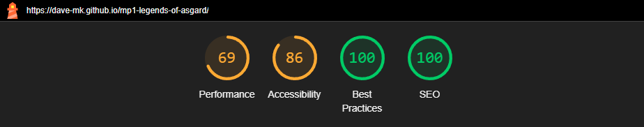

# Website Testing Checklist: Legends of Asgard

| **Test Area**             | **Test Description**                                                                                   | **Pass/Fail** | **Comments**             | **Retest Pass/Fail** |
|---------------------------|-------------------------------------------------------------------------------------------------------|---------------|--------------------------|----------------------|
| **1. General Layout and Responsiveness** |
| Desktop layout            | Ensure the site layout renders correctly on standard desktop resolutions.                             |               |                          |                      |
| Mobile responsiveness     | Check layout on smaller screens (mobile devices) for proper scaling, spacing, and alignment.          |               |                          |                      |
| Tablet responsiveness     | Verify layout adjusts properly on tablets (e.g., iPads).                                              |               |                          |                      |
| Cross-browser compatibility | Test on Chrome, Firefox, Edge, and Safari to ensure consistent design and functionality.             |               |                          |                      |
| Mobile orientation        | Ensure all elements adjust correctly between portrait and landscape orientations.                     |               |                          |                      |
| **2. Thematic and Visual Design** |
| Visual consistency        | Ensure the site's Norse mythology theme is maintained throughout fonts, colours, and imagery.         |               |                          |                      |
| Logo visibility           | Confirm the logo displays clearly and is properly aligned across all pages.                          |               |                          |                      |
| Background elements       | Verify that background images, gradients, or patterns display without distortion or tiling issues.    |               |                          |                      |
| Colour contrast           | Check that text is easily readable against the background (meet WCAG accessibility guidelines).       |               |                          |                      |
| Image quality             | Verify images and illustrations (e.g., gods, mythology elements) are clear and optimised for web.     |               |                          |                      |
| **3. Navigation Menu** |
| Navigation visibility     | Ensure the navigation menu is present and visible on all pages.                                       |               |                          |                      |
| Menu links                | Confirm all menu links navigate to the correct sections/pages (e.g., homepage, characters, history).  |               |                          |                      |
| Active menu styling       | Check if the active section/page is visually highlighted in the menu.                                 |               |                          |                      |
| Mobile menu functionality | Ensure the menu works correctly on mobile devices (e.g., hamburger menu expands/collapses).           |               |                          |                      |
| Smooth scrolling          | Confirm that menu links for internal sections (e.g., "About", "Characters") enable smooth scrolling.  |               |                          |                      |
| **4. Content Verification** |
| Text accuracy             | Verify all text content is free from spelling or grammatical errors.                                  |               |                          |                      |
| Heading structure         | Ensure heading levels (H1, H2, etc.) follow a logical hierarchy.                                      |               |                          |                      |
| Mythology content         | Check that all information about Norse gods, myths, and legends is accurate and complete.            |               |                          |                      |
| Image alt attributes      | Verify all images include descriptive alt text for accessibility and SEO.                            |               |                          |                      |
| **5. Links** |
| Internal links            | Confirm all internal links navigate to the correct sections/pages within the site.                   |               |                          |                      |
| External links            | Test any external links to ensure they open in a new tab and lead to the correct destination.         |               |                          |                      |
| Broken links              | Verify there are no broken links using a manual check or an online link checker.                     |               |                          |                      |
| **6. Interactive Elements** |
| Hover effects             | Verify hover effects (e.g., on buttons, links, or images) work correctly and align with the theme.    |               |                          |                      |
| Call-to-action buttons    | Check that all buttons (e.g., "Learn More", "Explore") navigate or perform actions as expected.       |               |                          |                      |
| Animation/scroll effects  | Ensure animations and scroll effects (if any) function correctly and enhance the user experience.     |               |                          |                      |
| **7. Accessibility** |
| Keyboard navigation       | Confirm that the site is fully accessible using keyboard navigation (Tab key).                       |               |                          |                      |
| Screen reader usability   | Test the website with a screen reader to ensure all content is accessible and meaningful.             |               |                          |                      |
| ARIA roles (if applicable)| Verify interactive elements (e.g., navigation, buttons) have appropriate ARIA roles.                 |               |                          |                      |
| **8. Footer** |
| Footer visibility         | Confirm the footer is present and visible across all pages.                                          |               |                          |                      |
| Footer links              | Verify all links in the footer (e.g., social media, additional resources) work correctly.            |               |                          |                      |
| Copyright info            | Check the copyright notice is accurate and properly styled.                                          |               |                          |                      |
| **9. Performance** |
| Page load speed           | Test the website’s performance using Lighthouse or PageSpeed Insights (target under 3 seconds).       |               |                          |                      |
| Image optimisation        | Ensure all images are compressed without noticeable quality loss.                                    |               |                          |                      |
| Caching and reload        | Confirm the site reloads quickly, leveraging browser caching.                                        |               |                          |                      |
| **10. Error Handling** |
| 404 error page            | Navigate to a non-existent URL and confirm a custom 404 page is displayed.                          |               |                          |                      |
| Downtime/network handling | Test how the website behaves during slow network conditions or offline mode.                         |               |                          |                      |
| **11. SEO** |
| Meta titles and descriptions | Verify each page has an appropriate meta title and description.                                     |               |                          |                      |
| Headings for SEO          | Ensure headings (H1, H2) are keyword-rich and follow a structured format.                            |               |                          |                      |
| Image SEO                 | Check that all images have meaningful file names and alt attributes for SEO purposes.                |               |                          |                      |

## LIGHTHOUSE REPORTS
### First Report - 27/01/2025

